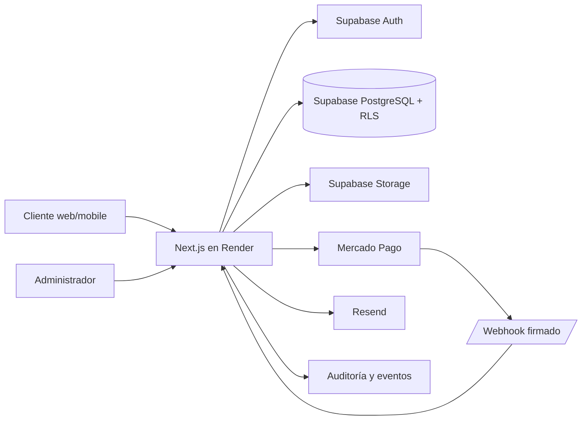

# Materiales FZAC - System Design y preparación para producción

Fecha: 27 de julio de 2026  
Estado: Aprobado para continuar en entorno de prueba; producción comercial todavía bloqueada  
Commit base auditado: `86d3843`

## 1. Resumen ejecutivo

Materiales FZAC ya cuenta con una arquitectura coherente para operar como un e-commerce real: Next.js concentra frontend y backend, Supabase aporta identidad y persistencia, Mercado Pago queda aislado detrás de adaptadores server-side y Render ejecuta un único servicio desplegable. Los invariantes críticos están implementados: el servidor recalcula precios y stock, la idempotencia evita compras duplicadas, el frontend no confirma pagos, el stock se modifica únicamente mediante confirmación server-side y las credenciales privadas no forman parte del bundle cliente.

Este lote completó la base SEO sin publicar todavía la URL temporal de Render. Se agregaron metadata, canonical, Open Graph, manifest, robots, sitemap y datos estructurados para tienda, buscador, productos y breadcrumbs. `SEO_INDEXING_ENABLED=false` mantiene a los buscadores fuera hasta disponer del dominio definitivo. La auditoría remota posterior alineó migraciones, RLS, Auth y Storage y cerró los RPC de pago al rol de servicio.

La salida a producción todavía depende de cuatro decisiones externas: dominio final, credenciales productivas exclusivas de Mercado Pago, dominio de email en Resend y definición del proveedor fiscal. Ninguna de estas condiciones fue simulada ni activada.

## 2. Objetivos y límites

### Objetivos

- Mantener el e-commerce desplegable y seguro mientras se completa la configuración comercial.
- Preparar SEO técnico y datos estructurados sin indexar el hostname temporal.
- Evitar cachear o indexar cuenta, checkout, carrito y resultados de pago.
- Mantener pagos test y producción separados mediante variables y barreras explícitas.
- Conservar idempotencia de checkout, webhook, tickets, reembolsos y stock.
- Obtener un build reproducible con cero vulnerabilidades conocidas en dependencias de producción.

### Fuera de alcance

- Activar cobros reales sin dominio y checklist final.
- Ejecutar migraciones o modificar RLS desde esta auditoría.
- Emitir factura fiscal ARCA sin proveedor fiscal configurado.
- Sustituir fotos definitivas o datos comerciales que todavía no fueron entregados.
- Convertir CSP Report-Only en bloqueante sin observar primero los flujos reales.

## 3. Arquitectura propuesta y actual

### Componentes

| Componente | Responsabilidad | Estado seguro |
| --- | --- | --- |
| Next.js App Router | UI, Route Handlers, metadata y middleware | Build y rutas validados |
| Supabase Auth | Sesión, email/password y Google OAuth | Remoto auditado; redirect de dominio final pendiente |
| PostgreSQL + RLS | Productos, pedidos, pagos, tickets, stock y auditoría | Migraciones remotas alineadas y Security Advisor auditado |
| Mercado Pago | Checkout Pro, tarjeta segura, consulta de pagos y reembolsos | Test habilitado; producción bloqueada |
| Webhook | Confirmación server-side y transición de estado | Firma, ambiente e idempotencia probados |
| Resend | Emails transaccionales | Integración preparada; dominio/remitente pendiente |
| Render | Build, ejecución, health check y variables | Servicio unificado y flags productivos bloqueados |
| SEO | Descubrimiento, canonical y datos estructurados | Implementado; indexación desactivada |

## 4. Flujo de compra

1. El cliente autenticado arma el carrito y selecciona entrega y medio de pago.
2. El frontend genera una clave idempotente y bloquea el doble envío.
3. `/api/checkout/create` valida sesión, origen, rate limit y esquema Zod.
4. El backend consulta productos activos, recalcula precios y verifica stock.
5. La RPC atómica crea orden, ítems y pago pendiente, asociando la clave idempotente.
6. Solo `MERCADOPAGO` crea preferencia y devuelve redirección.
7. Transferencia y WhatsApp crean pedidos pendientes sin redirección a Mercado Pago.
8. El webhook consulta el pago real al proveedor y valida monto, moneda, ambiente y orden.
9. Solo un pago aprobado ejecuta la RPC de finalización, descuenta stock y emite comprobante interno.
10. Reintentos de checkout o webhook reutilizan identificadores y no repiten efectos.

## 5. Contratos e invariantes

| Campo | Propósito | Garantía |
| --- | --- | --- |
| `idempotency_key` | Identifica un intento estable de checkout | Índice único parcial y búsqueda previa |
| `order_id` | Referencia interna de la compra | Se usa como `external_reference` |
| `payment_method` | Mercado Pago, transferencia o WhatsApp | Solo Mercado Pago puede devolver `redirect_url` |
| `provider_payment_id` | Identificador del proveedor | Solo server-side y no es dato principal en UI |
| `payment_events` | Sobre sanitizado del webhook | Sin tokens, tarjeta ni payload crudo |
| `order_status` | Estado comercial | Transiciones server-side |
| `payment_status` | Estado financiero | No se confía en el frontend |

Invariantes:

- No confirmar pagos desde componentes cliente.
- No descontar stock antes de pago aprobado o aprobación administrativa.
- No crear tickets duplicados.
- No aceptar precio, total o disponibilidad enviados por el navegador como fuente de verdad.
- No usar `service_role` ni Access Token de Mercado Pago en módulos cliente.
- No activar producción con credenciales base o test.
- No indexar superficies privadas ni el hostname temporal.

## 6. Seguridad y privacidad

### Controles confirmados

- Autorización administrativa en layout server-side y APIs.
- Protección de origen para mutaciones, con excepción limitada al webhook externo.
- Rate limits en rutas sensibles.
- Webhook con firma HMAC, comparación segura y validación `live_mode`.
- Eventos de proveedor sanitizados.
- Respuestas de autenticación neutras para reducir enumeración de cuentas.
- Redirecciones internas validadas contra open redirect.
- Headers defensivos, CSP Report-Only, HSTS en producción y bloqueo de framing.
- `Cache-Control: private, no-store` y `X-Robots-Tag: noindex` en superficies privadas.
- PostCSS actualizado a una versión parcheada.
- Cero vulnerabilidades conocidas en dependencias de producción.

### Riesgos pendientes

- La protección de contraseñas filtradas de Supabase requiere un plan Pro.
- CAPTCHA permanece pendiente hasta disponer de Turnstile/hCaptcha y un secret dedicado.
- Las tablas Prisma heredadas quedaron aisladas, pero su eliminación requiere definir retención.
- CSP todavía es Report-Only; debe observarse con Google OAuth y Mercado Pago antes de bloquear.
- Las claves compartidas durante desarrollo deben rotarse antes de producción.
- La revisión legal final debe ser realizada por un profesional.
- El tooling de ESLint mantiene una alerta de desarrollo en una dependencia transitiva; no forma parte del runtime y no recibe entradas del cliente. No se forzó una actualización incompatible.

## 7. SEO, GEO y descubrimiento

Implementado:

- Metadata base en español de Argentina.
- Canonical para home, productos, catálogo, ofertas, categorías y detalle.
- Open Graph y Twitter cards.
- Manifest instalable con identidad FZAC.
- `OnlineStore`, `WebSite`, `SearchAction`, `Product`, `Offer` y `BreadcrumbList`.
- Sitemap dinámico de rutas públicas, productos y categorías activas.
- Robots dinámico con bloqueo de APIs, cuenta, checkout, carrito, auth y admin.
- Área servida declarada como Rosario y alrededores, sin inventar dirección física.

Condición de lanzamiento:

- Mantener `SEO_INDEXING_ENABLED=false` hasta configurar el dominio final.
- Luego validar canonical, structured data, Search Console y sitemap antes de cambiar a `true`.

## 8. Preparación operativa

| Control | Estado |
| --- | --- |
| TypeScript | OK |
| ESLint | OK |
| Build Next.js | OK |
| Escaneo de secretos | OK |
| Audit dependencias de producción | 0 vulnerabilidades |
| Playwright seguridad | 20/20 |
| Playwright público | 15/15; 4 mutaciones omitidas |
| SEO técnico | Implementado y bloqueado hasta dominio |
| RLS local | Cubierto por migraciones |
| RLS remoto | Auditado y migraciones alineadas |
| Mercado Pago test | Conservado |
| Mercado Pago producción | Bloqueado |
| Email transaccional | Pendiente de dominio verificado |
| Facturación fiscal | Pendiente de proveedor |

## 9. Alternativas descartadas

- Indexar el dominio de Render ahora: descartado para no dividir señales SEO ni consolidar canonicals temporales.
- Activar Mercado Pago real antes del dominio: descartado porque back URLs, webhook y OAuth deben compartir el origen final.
- Forzar `npm audit fix --force`: descartado porque proponía cambios incompatibles en Next/ESLint.
- Abrir tablas o relajar RLS para simplificar el frontend: descartado por riesgo de acceso entre usuarios.

## 10. Decisión y próximos pasos

La decisión recomendada es continuar sobre la arquitectura actual. No hace falta recrear ni separar frontend y backend. El siguiente orden reduce riesgo:

1. Completar catálogo real, fotos, textos comerciales y datos legales.
2. Elegir dominio, configurar DNS, Supabase Auth y Google OAuth.
3. Verificar dominio de email y probar registro, recuperación y arrepentimiento.
4. Configurar credenciales productivas exclusivas de Mercado Pago.
5. Ejecutar una compra real de bajo monto y un reembolso controlado.
6. Configurar facturación fiscal o definir explícitamente el alcance del comprobante.
7. Observar CSP, pasarla a bloqueante y habilitar `SEO_INDEXING_ENABLED=true`.
8. Registrar Search Console y enviar sitemap.

Producción no debe habilitarse hasta que dominio, RLS remoto, email, pagos y operación fiscal tengan evidencia de aceptación.
